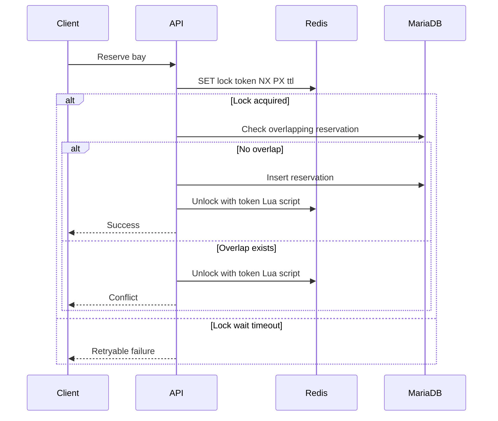
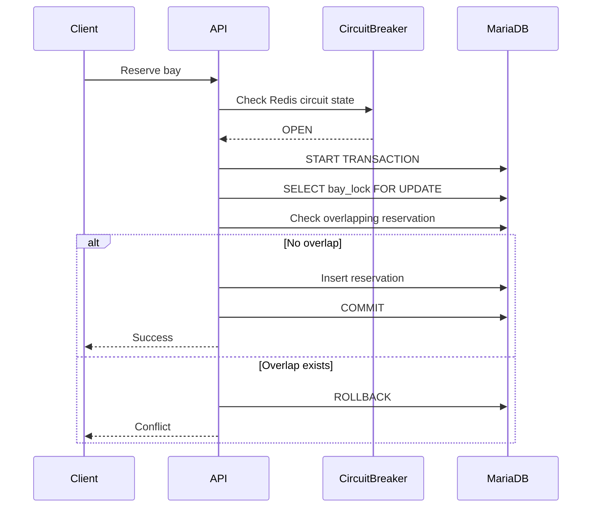
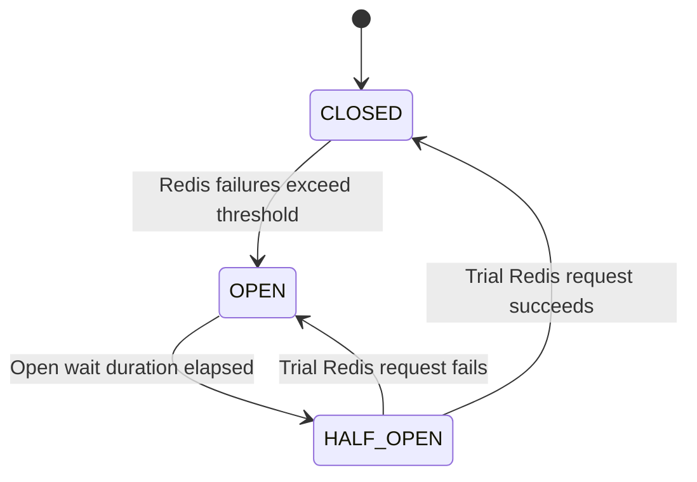

# Golf Reservation Concurrency Design

## 1. 설계 요약

정상 상황에서는 Redis 기반 타석 단위 락을 사용한다. Redis 장애가 감지되면 circuit breaker가 열리고, Redis 접근을 생략한 뒤 MariaDB `SELECT ... FOR UPDATE` 기반 fallback으로 예약을 처리한다.

정상 경로에서 Redis와 MariaDB 락을 항상 함께 사용하지는 않는다. 정상 경로는 Redis 락으로 직렬화하고, Redis 장애 경로에서만 DB 락을 사용한다.

```text
Normal:
Redis lock
-> MariaDB overlap check
-> reservation insert
-> Redis unlock

Redis failure:
Circuit breaker OPEN
-> MariaDB transaction
-> bay_lock SELECT FOR UPDATE
-> overlap check
-> reservation insert
-> commit
```

## 2. 왜 두 경로를 나누는가

Redis가 정상이라면 같은 `bay_id`에 대한 요청은 Redis 락으로 직렬화된다. 따라서 정상 경로에서 MariaDB `SELECT FOR UPDATE`까지 항상 사용하는 것은 중복 락 구조가 될 수 있다.

다만 Redis가 장애이거나 Redis 접근이 불안정한 상황에서 예약 기능을 완전히 중단하지 않기 위해 DB fallback을 둔다. 이때 MariaDB row lock은 최종 정합성을 지키는 fallback 역할을 한다.

## 3. Redis 락 설계

### 3.1 락 키

```text
reservation:lock:bay:{bayId}
```

락 단위는 타석이다. 골프존 단위로 락을 잡으면 서로 다른 타석 예약까지 막아 처리량이 떨어진다.

### 3.2 락 획득

Redis의 원자적 명령을 사용한다.

```text
SET reservation:lock:bay:{bayId} {lockToken} NX PX {lockTtlMillis}
```

- `NX`: key가 없을 때만 set한다.
- `PX`: TTL을 millisecond 단위로 설정한다.
- `lockToken`: 락 소유자를 식별하는 랜덤 값이다.

### 3.3 락 해제

락 해제는 반드시 token 검증 후 수행한다.

```lua
if redis.call("GET", KEYS[1]) == ARGV[1] then
  return redis.call("DEL", KEYS[1])
else
  return 0
end
```

단순 `DEL`은 위험하다. 내 락이 TTL로 만료된 뒤 다른 요청이 새 락을 잡았을 수 있기 때문이다. 이때 단순 `DEL`을 실행하면 다른 요청의 락을 삭제할 수 있다.

### 3.4 타임아웃 분리

Redis 관련 타임아웃은 서로 다른 의미를 가진다.

```text
Redis command timeout:
  Redis 명령 하나가 응답을 기다리는 최대 시간
  예: 50ms ~ 200ms

Lock wait timeout:
  다른 요청이 락을 잡고 있을 때 재시도하며 기다리는 최대 시간
  예: 10s

Lock TTL:
  락을 잡은 서버가 죽었을 때 자동 해제되기까지의 시간
  예: P99 예약 처리 시간 + 여유
```

Redis 장애 상황에서 10초 동안 스핀하면 안 된다. 10초 대기는 Redis가 정상이고, 다른 요청이 같은 타석 락을 잡고 있는 경우에만 의미가 있다.

## 4. 정상 예약 흐름



## 5. Redis 장애 흐름

Redis 명령 실패 또는 timeout이 반복되면 circuit breaker를 OPEN한다. OPEN 상태에서는 Redis 락을 시도하지 않고 DB fallback으로 바로 진입한다.



## 6. Circuit Breaker 상태



상태 의미:

```text
CLOSED:
  Redis 정상으로 간주한다.
  Redis 락을 사용한다.

OPEN:
  Redis 장애로 간주한다.
  일정 시간 Redis 접근을 생략한다.
  DB fallback을 사용한다.

HALF_OPEN:
  제한된 요청만 Redis를 시험한다.
  성공하면 CLOSED로 복귀한다.
  실패하면 OPEN을 유지한다.
```

## 7. MariaDB fallback 설계

### 7.1 bay_lock 테이블

```sql
CREATE TABLE bay_lock (
    bay_id BIGINT NOT NULL PRIMARY KEY,
    updated_at DATETIME(6) NOT NULL
);
```

`bay_lock` row는 타석 생성 시 함께 생성한다. 예약 요청 중에 동적으로 생성하면, 락 row 생성 자체의 동시성 처리가 추가로 필요해진다.

### 7.2 fallback transaction

```sql
SET SESSION innodb_lock_wait_timeout = 3;

START TRANSACTION;

SELECT bay_id
FROM bay_lock
WHERE bay_id = :bay_id
FOR UPDATE;

SELECT 1
FROM reservation
WHERE bay_id = :bay_id
  AND status IN ('RESERVED', 'PAID')
  AND start_at < :new_end_at
  AND end_at > :new_start_at
LIMIT 1;

-- no overlap이면 INSERT

COMMIT;
```

실패 시 반드시 `ROLLBACK`한다. `SELECT FOR UPDATE`로 잡은 row lock은 `COMMIT` 또는 `ROLLBACK` 시 자동 해제된다.

### 7.3 transaction boundary

트랜잭션 안에 들어가야 하는 작업:

```text
- bay_lock SELECT FOR UPDATE
- reservation overlap check
- reservation insert
- 필요한 예약 상태 변경
```

트랜잭션 밖에 있어야 하는 작업:

```text
- Redis lock wait loop
- 외부 결제 승인
- 알림 발송
- 느린 로깅
- 외부 API 호출
```

트랜잭션은 가능한 짧게 유지한다.

## 8. Phantom Read에 대한 설명

이 설계는 `reservation` 테이블의 시간 범위에 gap lock을 직접 거는 방식이 아니다. 대신 `bay_lock` row를 통해 같은 타석의 예약 생성 흐름 전체를 직렬화한다.

동시에 두 요청이 들어오면 다음 순서가 된다.

```text
T1: bay_lock row lock 획득
T2: bay_lock row lock 대기

T1: overlap check
T1: reservation insert
T1: commit

T2: bay_lock row lock 획득
T2: overlap check
```

T2는 T1이 commit한 뒤 중복 검사를 수행한다. 따라서 T1이 생성한 예약을 보고 충돌을 감지할 수 있다.

중요한 전제:

```text
모든 예약 생성 경로는 반드시 Redis lock 또는 DB fallback lock 정책을 통과해야 한다.
```

어떤 코드가 이 정책을 우회해 `reservation`에 직접 insert하면 정합성이 깨질 수 있다.

## 9. 권장 격리 수준

fallback transaction은 `READ COMMITTED`를 우선 검토한다.

```sql
SET TRANSACTION ISOLATION LEVEL READ COMMITTED;
```

이유:

- fallback 경로에서는 `bay_lock` row로 직렬화하므로 반복 가능한 snapshot보다 최신 commit을 읽는 동작이 더 직관적이다.
- T2가 lock을 획득한 뒤 T1의 commit 결과를 보는 흐름을 설명하기 쉽다.

단, 프로젝트의 전역 격리 수준이 `REPEATABLE READ`라면 실제 DB와 ORM 동작을 테스트로 확인한 뒤 결정한다.

## 10. Java Redis Client 선택

권장 기본값:

```text
Spring Data Redis + Lettuce
```

이유:

- Spring Boot 통합이 좋다.
- Lettuce는 Netty 기반이며 sync, async, reactive API를 제공한다.
- Redis command timeout, connection timeout, reconnect 정책을 세밀하게 구성할 수 있다.
- `SET NX PX`와 Lua unlock을 직접 구현하기 좋다.

Redisson `RLock`은 대안이다. 분산락 API, watchdog, `tryLock` 같은 고수준 기능을 제공하지만, 이 설계에서는 lock token, TTL, circuit breaker, DB fallback을 명시적으로 통제하는 쪽을 우선한다.

## 11. 설계 불변 조건

- 락 key는 반드시 `bay_id` 단위여야 한다.
- Redis lock value는 반드시 랜덤 token이어야 한다.
- unlock은 token 검증 Lua script로만 수행한다.
- Redis command timeout과 lock wait timeout을 혼동하지 않는다.
- Redis circuit OPEN 상태에서는 Redis 접근을 생략한다.
- DB fallback은 반드시 transaction 안에서 `SELECT FOR UPDATE`를 실행한다.
- `bay_lock` row는 타석 생성 시 함께 생성한다.
- 예약 생성 경로는 이 설계를 우회하면 안 된다.

